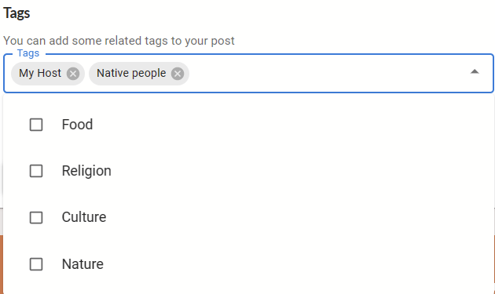

# Build an autocomplete component

Reference

- It should allow multiple selection with checkboxes
- Selected elements should show as tags with a button to delete the
  selection.
- Filtering by search text
- Toggle button for expand/collapse list

STEPS
1. Create a mocked list of items and show them in the screen
2. Add checkboxes and allow multiple selection
3. Submit selection and remove those from the list
4. Show the selected items in some other place (eventually the input)
5. Allow removing elements by clicking them and re-add them to the list
6. Build the input structure: label, input, and submit
7. Filter the results by user input
8. Show/Hide list with a toggle button

Nice to have
- Style the list
- Debounce the input in case we are actually fetching from an API
